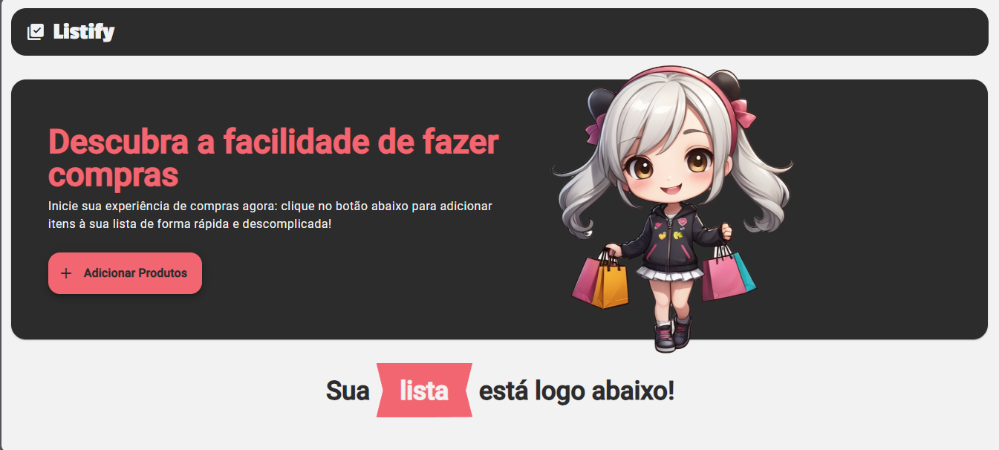

<div align="center">
  <h1>- Listify: Sua Lista de Compras Simplificada-</h1>
</div>

O **Listify** é uma aplicação web pensada para facilitar a sua experiência de criar e gerenciar listas de compras de forma prática e rápida. Mais do que apenas um simples gerenciador de itens, o Listify oferece uma interface simples e intuitiva, perfeita para quem gosta de manter tudo organizado de maneira fácil e eficiente!

<div>
  
<ul>
  <li><strong>Adição Rápida de Itens:</strong> Com apenas um campo de texto, você pode adicionar rapidamente os itens à sua lista. Tudo acontece em tempo real, de forma dinâmica e prática!</li>
  <li><strong>Edição Simples:</strong>Precisa alterar algo? Sem problemas! Você pode editar qualquer item da lista de maneira direta e fácil, mantendo tudo atualizado.</li>
  <li><strong>Marcar Como Comprado:</strong>Ao realizar suas compras, basta marcar os itens como comprados. Eles ganharão uma nova aparência (podem ficar riscados ou mudar de cor), para que você saiba exatamente o que já pegou.</li>
  <li><strong>Organização por Status:</strong>Seus itens serão automaticamente organizados em duas categorias: "Comprados" e "Não Comprados", ajudando a manter tudo ainda mais visualmente organizado.</li>
  <li><strong>Exclusão de Itens:</strong>Adicionou algo por engano? Com um clique no ícone de lixeira ao lado do item, você pode removê-lo da lista de maneira super simples.</li>
  <li><strong>Design Limpo e Responsivo:</strong>O layout do Listify foi pensado para ser minimalista e funcional, adaptando-se perfeitamente a qualquer dispositivo, seja seu celular, tablet ou computador. Você pode acessar sua lista em qualquer lugar!</li>
</ul>
</div>

<h2> 🧮 Ferramentas e tecnologias </h2>


<h2> 🛠️ Criando e executando localmente o projeto </h2>

Criar e executar o TrainSys em seu ambiente de desenvolvimento local é muito fácil. Certifique-se de ter o [Git](https://git-scm.com/downloads), [Node.js](https://nodejs.org/en/) (versão 14.x ou superior) e [Angular CLI](https://angular.io/cli) (versão mais recente) instalados e siga as instruções abaixo.


1. Clone o código fonte:

```bash
git clone https://github.com/VeronicaVilas/listify.git
```

2. Acesse o diretório do projeto:

```bash
cd listify
```

3. Instale as dependências:

```bash
npm install
```

4. Rode o banco de dados localmente:

```bash
npx json-server db.json 
```

4. Rode a aplicação localmente:

```bash
npm start
```


------------
Disponibilizado por [Verônica Vilas](https://www.linkedin.com/in/veronica-vilas/ "veronica-vilas").
